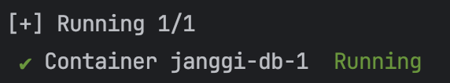

### Docker 정보

Docker version: 28.0.1, build 068a01e

### MySQL 서버 버전 정보

MySQL 서버의 버전 정보: 8.0.28

### Docker 정지하기

docker-compose -p janggi down

### 테이블 생성

```보드 SQL
CREATE TABLE Board (
    row_value INT NOT NULL,
    column_value INT NOT NULL,
    type VARCHAR(64) NOT NULL,
    dynasty VARCHAR(64) NOT NULL,
    PRIMARY KEY (row_value, column_value)
);
```

```턴 SQL
CREATE TABLE Turn (
    id TINYINT NOT NULL PRIMARY KEY DEFAULT 1,
    turn INT NOT NULL
);
INSERT INTO Turn (id, turn) VALUES (1, 0);
```

### DB 설정 방법

- 터미널에서 java-janggi/docker 폴더로 이동한 후 `docker-compose -p janggi up -d` 명령어를 실행하여 docker 컨테이너를 백그라운드에서 실행 시킵니다.
- 
- 실행 중인 docker의 상태는 `docker ps` 명령어로 확인할 수 있습니다.


- MySQL에 접속하려면 docker exec -it <mysql-container-id> mysql -u root -p 명령어를 사용합니다.
    - <mysql-container-id>는 `docker ps` 명령어로 확인할 수 있습니다.

- 유저 생성: `create user 'username'@'localhost' identified by 'password';`
- 생성한 유저에게 모든 DB 및 테이블에 접근 권한 부여: `grant all privileges on *.* to 'username'@'localhost';`
- 설정한 권한 적용: `flush privileges;`


- docker를 정지하고 싶다면, java-janggi/docker로 가서 터미널에 `docker-compose -p janggi down`를 입력한다.