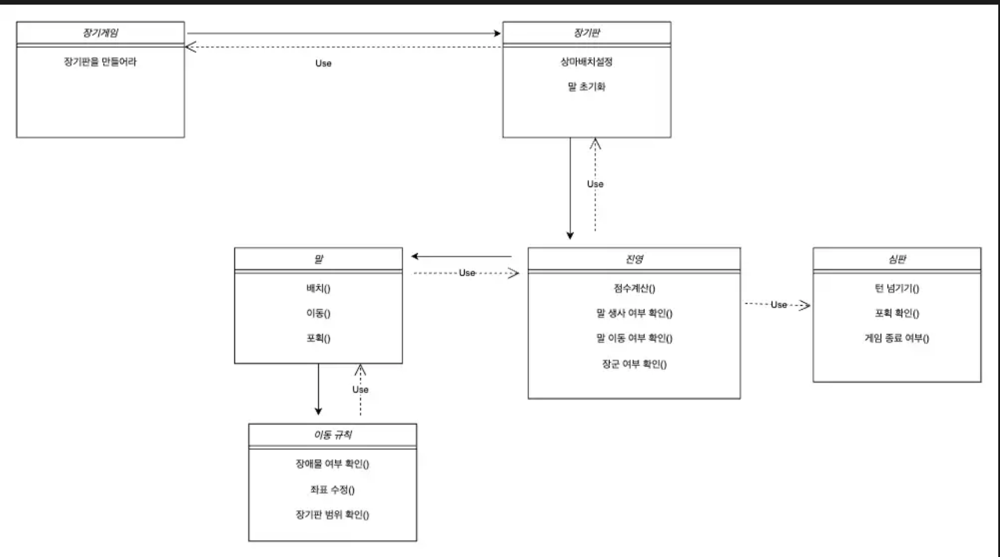

# java-janggi

장기 미션 저장소

---

1. 초기 설계

    1) UML 다이어그램

       

    2) 플로우 차트

        - [1] 입력: 사용자로부터 초한 순으로 상차림을 입력받는다
        - [2] 출력: 장기 말들이 초기화된 장기 보드를 출력한다
        - [3] 입력: 움직일 팀 이름을 입력받는다
        - [4] 입력: 움직이고자 하는 기물 이름과 기물의 시작 좌표를 입력받는다
        - [5] 검증: 해당 팀에 해당 말의 이름과 시작 좌표가 맞는지 확인한다
        - [6] 입력: 움직이고자 하는 기물의 도착 좌표를 입력받는다
        - [7] 검증: 도착 좌표에 우리 팀의 말이 있는지 확인한다
        - [8] 검증: 이동하고자 하는 경로의 좌표들에 장애물이 있는지 확인한다
        - [9] 출력: 새롭게 이동한 기물의 좌표가 반영된 장기 보드를 출력한다

2. 기능 구현 목록

    - [1] 게임 매니저
        - [x] 장기 게임 흐름 제어
        - [x] 잘못된 입력에 대해 재입력 요청
        - [x] 왕이 잡힌 경우 게임 종료
        - [x] 각 진영의 최종 점수 계산
    - [2] 장기 판
        - [x] 진영의 순서 교체 확인
        - [x] 장기 판 범위 내 이동 검증
        - [x] 시작 좌표와 도착 좌표 사이의 경로 좌표 반환
    - [3] 장기 판 세팅
        - [x] 상차림 설정
    - [4] 위치
        - [x] 좌표 값 [x, y] 저장
        - [x] 좌표 값 비교 및 갱신
    - [5] 궁성
        - [x] 진영별 궁성 영역 설정
        - [x] 궁 내에 좌표가 있는지 확인
    - [6] 장기 말
        - [x] 말의 위치 이동 갱신
        - [x] 말의 포획 여부 갱신
        - [x] 말의 이동 규칙 적용 여부 확인
            - 왕, 사, 차, 포, 졸병의 시작 좌표가 궁인 경우, 대각선 이동 규칙을 추가 적용
        - [x] 말의 특정 좌표 차지 여부 확인
        - [x] 말의 속성 값 일치 여부 확인
        - [x] 말의 이동 규칙 저장
    - [7] 진영
        - [x] 진영별 말 초기화
        - [x] 진영별 특정 말 탐색
        - [x] 진영별 말의 궁성 관련 검증
        - [x] 말의 위치 및 이동 규칙 관련 검증
        - [x] 말의 포획 여부 갱신
        - [x] 진영별 점수 갱신

3. 입력 예시

    1) 각 진영의 상차림을 입력한다
        - EHEH
    2) 움직일 진영을 입력한다
        - CHO
    3) 움직일 말의 이름과 시작 좌표를 입력한다
        - E-[1, 0]
    4) 움직일 말의 도착 좌표를 입력한다
        - [3, 3]
    5) 게임 추가 진행 여부를 입력한다
        - Y

---
