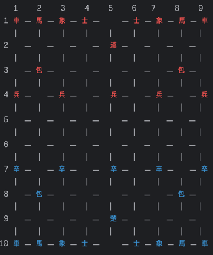
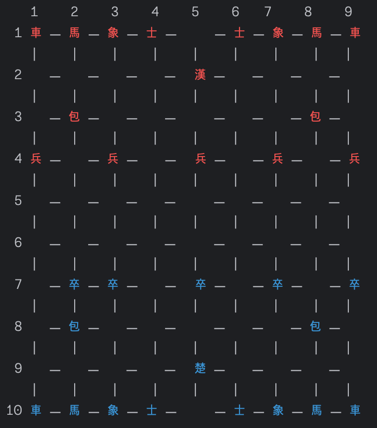
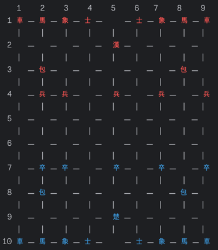
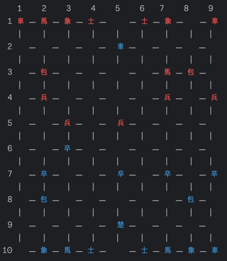

# java-janggi

# 기능 요구 사항

```
게임은 초나라부터 시작한다.
```

### 0. 게임을 로드한다.
- 게임이 처음 시작되거나, 게임이 정상 종료된 경우 새롭게 시작한다.
- 게임이 진행중인 경우, 다음 차례부터 이어서 진행한다.
```shell
게임을 초기화하시겠습니까? (y/n)
```

### 1. 마와 상의 순서를 선택한다.

1. 마와 상을 배치할 수 있는 경우의 수는 다음과 같다.
    1. 상 마 상 마
    2. 마 상 마 상
    3. 상 마 마 상
    4. 마 상 상 마  
       <br/>
2. 사용자는 원하는 배치를 입력할 수 있다.

<br/>

### 2. 기물이 포진에 맞게 배치된다.

```
한 (빨간색) / 초 (파란색)
```

### 3. 포진에 따라 배치된 초기 장기판을 출력한다.

1. 각 기물은 다음과 같은 움직임을 수행한다.

| 이름          | 영어        | 설명                                                             |
|-------------|-----------|----------------------------------------------------------------|
| 왕(궁) (漢, 楚) | King      | 궁성 안에서 모든방향으로 한 칸씩 움직일 수 있다. 차례를 쉴 수도 있다. 궁성 밖을 나갈 수 없다.       |
| 사 (士)       | Guards    | 궁성 안에서 모든방향으로 한 칸씩 움직일 수 있다. 궁성 밖을 나갈 수 없다.                    |
| 마 (馬)       | Horses    | 직선으로 한 칸, 대각선으로 한 칸 이동한다.                                      |
| 상 (象)       | Elephants | 직선으로 한 칸, 대각선으로 두 칸 이동한다.                                      |
| 차 (車)       | Chariots  | 수직이나 수평으로 원하는 만큼 움직인다.                                         | 
| 포 (包)       | Cannons   | 뛰어넘은 말이 있을 경우에만, 수직이나 수평으로 원하는 만큼 움직일 수 있다. 포는 포를 넘거나 잡을 수 없다. | 
| 졸 (卒, 兵)    | Soldiers  | 앞, 양 옆으로 한 칸씩 움직인다. 뒤로 갈 수 없다.                                 |

> 궁성(Fortress) : 정사각형의 작은 공간으로, 왕(궁)과 사는 이 공간을 벗어날 수 없다.

2. 각 기물은 포진에 따라 다음과 같은 형태로 출력된다.

```
  ㅡ    ㅡ  
|    |   ㅣ
馬 ㅡ 象 ㅡ 包
```

3. 세로를 10의 자리, 가로를 1의 자리로 보아 좌표를 숫자로 표현한다.
    - 예를 들어, 초기의 초나라의 왕은 95의 좌표에 존재한다.

<br/>

### 4. 자신의 순서인 플레이어가 장기를 둔다.

1. 이동을 희망하는 기물의 현재 위치와 이동할 위치를 입력한다.
    - 해당 위치에 이동 가능한 기물이 존재하지 않은 경우 예외가 발생한다.
    - 해당 위치로 이동할 수 없는 경우 예외가 발생한다.
2. 이동 결과를 반영한 포진을 출력한다.
3. 1~3단계를 수행하면 다음 플레이어 차례로 넘어간다.
    - 왕을 잡으면 해당 플레이어의 승리로 게임은 종료된다.
    - 두 플레이어 모두 종료를 원할 경우, 게임은 종료된다.

<br/>

### 5. 점수를 계산한다.

- 초가 먼저 상차림을 주도하므로, 한나라가 1.5점의 덤이 주어진다.
  - 즉, 초나라는 72.0점, 한나라는 73.5점으로 시작한다.

| 이름          | 영어        | 점수                      |
|-------------|-----------|-------------------------|
| 왕(궁) (漢, 楚) | King      | -점 (왕이 잡히면 게임에서 이기게 된다) |
| 사 (士)       | Guards    | 3점                      |
| 마 (馬)       | Horses    | 5점                      |
| 상 (象)       | Elephants | 3점                      |
| 차 (車)       | Chariots  | 13점                     | 
| 포 (包)       | Cannons   | 7점                      | 
| 졸 (卒, 兵)    | Soldiers  | 2점                      |

> 대국에서 승부가 나지 않았을 때, 기물의 점수로 승패를 가린다.

### 6. 게임 결과를 출력한다.

```
한나라의 승리입니다!

점수
한나라 : 73.5점
초나라 : 72.0점
```

<br/>

## 예상 출력 형식

```
게임을 초기화하시겠습니까? (y/n)
y

장기 게임을 시작하겠습니다!

마와 상을 배치할 수 있는 경우의 수는 다음과 같습니다.
1. 상 마 상 마
2. 마 상 마 상
3. 상 마 마 상
4. 마 상 상 마

한나라의 배치 순서를 선택해주세요.
4
초나라의 배치 순서를 선택해주세요.
4

```



```
초나라의 순서입니다.

이동을 희망하는 기물의 현재 위치와 해당 기물이 이동할 위치를 입력해주세요.
(세로를 10의 자리, 가로를 1의 자리로 보아 좌표를 입력해주세요. 예를 들어 초기 초나라의 왕의 좌표는 95입니다.)
ex) 71 72
71 72

```



```
한나라의 순서입니다.

이동을 희망하는 기물의 현재 위치와 해당 기물이 이동할 위치를 입력해주세요.
(세로를 10의 자리, 가로를 1의 자리로 보아 좌표를 입력해주세요. 예를 들어 초기 초나라의 왕의 좌표는 95입니다.)
ex) 71 72
41 42

```



```
... 중략 ...
```



```

초나라의 승리입니다!

점수
한나라 : 73.5점
초나라 : 72.0점
```

## 예외 상황

1. 마와 상을 배치할 수 있는 선택지 이외의 값을 입력한 경우

```
장기 게임을 시작하겠습니다!

마와 상을 배치할 수 있는 경우의 수는 다음과 같습니다.
1. 상 마 상 마
2. 마 상 마 상
3. 상 마 마 상
4. 마 상 상 마

초나라의 배치 순서를 선택해주세요.
4
한나라의 배치 순서를 선택해주세요.
5

[ERROR] 잘못된 입력입니다.
한나라의 배치 순서를 선택해주세요.
```

2. 해당 위치에 이동 가능한 기물이 존재하지 않는 경우

```
   1    2    3   4    5    6   7    8    9    
 1 車 ㅡ 馬 ㅡ 象 ㅡ 士 ㅡ   ㅡ 士 ㅡ 象 ㅡ 馬 ㅡ 車
   |   |    |    |   |   |   |    |   |
 2   ㅡ   ㅡ   ㅡ   ㅡ 漢 ㅡ   ㅡ   ㅡ   ㅡ 
   |   |    |    |   |   |   |    |   |
 3   ㅡ 包 ㅡ   ㅡ   ㅡ   ㅡ   ㅡ   ㅡ 包 ㅡ 
   |   |    |    |   |   |   |    |   |
 4 兵 ㅡ   ㅡ 兵 ㅡ   ㅡ 兵 ㅡ   ㅡ 兵 ㅡ   ㅡ 兵
   |   |    |    |   |   |   |    |   |
 5   ㅡ   ㅡ   ㅡ   ㅡ   ㅡ   ㅡ   ㅡ   ㅡ 
   |   |    |    |   |   |   |    |   |
 6   ㅡ   ㅡ   ㅡ   ㅡ   ㅡ   ㅡ   ㅡ   ㅡ 
   |   |    |    |   |   |   |    |   |
 7 兵 ㅡ  ㅡ 兵 ㅡ   ㅡ 兵 ㅡ   ㅡ 兵 ㅡ   ㅡ 兵
   |   |    |    |   |   |   |    |   |
 8   ㅡ 包 ㅡ   ㅡ   ㅡ   ㅡ   ㅡ   ㅡ 包 ㅡ 
   |   |    |    |   |   |   |    |   |
 9   ㅡ   ㅡ   ㅡ   ㅡ 楚 ㅡ   ㅡ   ㅡ   ㅡ 
   |   |    |    |   |   |   |    |   |
10 車 ㅡ 馬 ㅡ 象 ㅡ 士 ㅡ   ㅡ 士 ㅡ 象 ㅡ 馬 ㅡ 車

초나라의 순서입니다.

이동을 희망하는 기물의 현재 위치와 해당 기물이 이동할 위치를 입력해주세요.
(세로를 10의 자리, 가로를 1의 자리로 보아 좌표를 입력해주세요. 예를 들어 초기 초나라의 왕의 좌표는 95입니다.)
ex) 71 72

72 73

[ERROR] 해당 좌표에 기물이 존재하지 않습니다.

이동을 희망하는 기물의 현재 위치와 해당 기물이 이동할 위치를 입력해주세요.
(세로를 10의 자리, 가로를 1의 자리로 보아 좌표를 입력해주세요. 예를 들어 초기 초나라의 왕의 좌표는 95입니다.)
ex) 71 72

```

3. 기물이 해당 위치로 이동할 수 없는 경우

```
   1    2    3   4    5    6   7    8    9    
 1 車 ㅡ 馬 ㅡ 象 ㅡ 士 ㅡ   ㅡ 士 ㅡ 象 ㅡ 馬 ㅡ 車
   |   |    |    |   |   |   |    |   |
 2   ㅡ   ㅡ   ㅡ   ㅡ 漢 ㅡ   ㅡ   ㅡ   ㅡ 
   |   |    |    |   |   |   |    |   |
 3   ㅡ 包 ㅡ   ㅡ   ㅡ   ㅡ   ㅡ   ㅡ 包 ㅡ 
   |   |    |    |   |   |   |    |   |
 4 兵 ㅡ   ㅡ 兵 ㅡ   ㅡ 兵 ㅡ   ㅡ 兵 ㅡ   ㅡ 兵
   |   |    |    |   |   |   |    |   |
 5   ㅡ   ㅡ   ㅡ   ㅡ   ㅡ   ㅡ   ㅡ   ㅡ 
   |   |    |    |   |   |   |    |   |
 6   ㅡ   ㅡ   ㅡ   ㅡ   ㅡ   ㅡ   ㅡ   ㅡ 
   |   |    |    |   |   |   |    |   |
 7 兵 ㅡ  ㅡ 兵 ㅡ   ㅡ 兵 ㅡ   ㅡ 兵 ㅡ   ㅡ 兵
   |   |    |    |   |   |   |    |   |
 8   ㅡ 包 ㅡ   ㅡ   ㅡ   ㅡ   ㅡ   ㅡ 包 ㅡ 
   |   |    |    |   |   |   |    |   |
 9   ㅡ   ㅡ   ㅡ   ㅡ 楚 ㅡ   ㅡ   ㅡ   ㅡ 
   |   |    |    |   |   |   |    |   |
10 車 ㅡ 馬 ㅡ 象 ㅡ 士 ㅡ   ㅡ 士 ㅡ 象 ㅡ 馬 ㅡ 車


초나라의 순서입니다.

이동을 희망하는 기물의 현재 위치와 해당 기물이 이동할 위치를 입력해주세요.
(세로를 10의 자리, 가로를 1의 자리로 보아 좌표를 입력해주세요. 예를 들어 초기 초나라의 왕의 좌표는 95입니다.)
ex) 71 72
71 73

[ERROR] 해당 좌표로 이동할 수 없습니다.

해당 기물이 이동할 위치를 입력해주세요.

```
