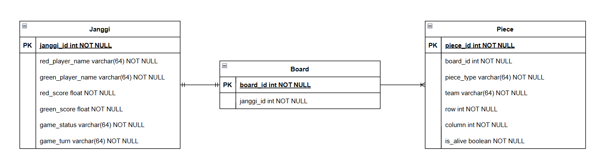
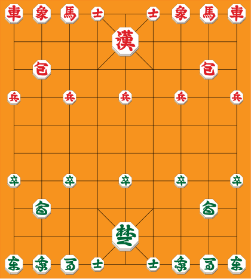

# java-janggi

장기 미션 저장소

## DB 실행

DB 실행을 위해 `docker`를 설치해야 합니다.

초기 DB 및 테이블 생성 로직은 `/docker/init.sql`에 작성하였습니다. 아래의 docker 명령어로 최초 실행 시, 자동으로 생성됩니다.

1. **프로젝트 디렉터리 내 `docker` 디렉터리로 이동**

2. **아래의 커맨드 실행**
   > docker-compose -p janggi up -d

3. **종료시 아래의 커맨드 실행**
   > docker-compose -p janggi down

### ER-Diagram



---

## 과제 진행 요구 사항

### 게임판

- 10행, 9열 크기의 게임판을 만든다.
- 궁(宮) 또는 궁성(宮城)의 영역을 고려한다.
    - 가로, 세로, 궁성 내 대각선 이동을 고려한다.

### 장기 기물

- `상`, `마`를 제외한 장기 기물은 아래의 이미지와 같이 배치해야 한다.    
  
- `상`과 `마`의 경우, 상차림 옵션을 제공하여 원하는 옵션을 선택하도록 한다.
    - 왼상차림(차 **상 마** 사 궁 사 **상 마** 차): 두 상이 모두 마의 왼쪽(대국자 기준)에 배치된다.
    - 오른상차림(차 **마 상** 사 궁 사 **마 상** 차): 두 상이 모두 마의 오른쪽에 배치된다.
    - 안상차림(차 **마 상** 사 궁 사 **상 마** 차): 두 상이 모두 사의 옆(궁에서 가까운 위치)에 배치된다.
    - 바깥상차림(차 **상 마** 사 궁 사 **마 상** 차): 두 상이 모두 차의 옆(궁에서 먼 위치)에 배치된다.


- 장기 기물 공통 규칙
    - 이동 경로에 기물이 존재하면 안된다.
        - 이동 경로의 도착지에는 상대방의 기물 또는 빈칸이여야 한다.
        - 포의 경우에는 이동 경로 내 기물이 1개만 존재해야 한다.
    - 현재 위치가 궁성 영역(중앙 제외)일 경우, 직선 이동하는 기물의 궁성 중앙 방향으로의 이동을 허용한다.
    - 현재 위치가 궁성 중앙 영역일 경우, 직선 이동하는 기물의 대각선 4방향 모두로 1칸 이동을 허용한다.


- 장기 기물의 종류
    - 궁·사
        - 수직/수평 1칸 이동 가능하다.
    - 차
        - 수직/수평으로 자유롭게 이동 가능하다.
    - 포
        - 수직/수평으로 포가 아닌 기물을 하나 뛰어넘고 이동 가능하다.
        - 상대방의 포가 목적지에 있으면 갈 수 없다.
    - 마
        - 수직/수평으로 1칸 이동 및 진행 뱡향 대각선으로 1칸 이동 가능하다.
    - 상
        - 수직/수평으로 1칸 이동 및 진행 뱡향 대각선으로 2칸 이동 가능하다.
    - 졸·병
        - 자신의 진영 기준 전진 및 좌우로 1칸 이동 가능하다.


- 기물 점수
    - 각 기물은 점수를 가지고 있다.

| 기물  | 점수  |
|:---:|:---:|
|  차  | 13점 |
|  포  | 7점  |
|  마  | 5점  |
|  상  | 3점  |
|  사  | 3점  |
| 졸·병 | 2점  |
|  궁  | 0점  |

- 게임 종료 조건
    - 상대방의 궁을 잡은 플레이어가 승리한다.
    - 두 플레이어의 기물이 궁만 남은 경우, 무승부로 처리한다.

### 플레이어

- 플레이어는 2명 참가할 수 있다.
- 플레이어는 `초(GREEN)` 팀부터 시작하여 게임 종료까지 한 번씩 번갈아 가며 기물을 이동한다.
- 플레이어는 적의 기물을 잡을 경우, 상대방은 기물에 맞는 점수를 잃는다.
- 초기 점수는 다음과 같이 제공한다.
    - `한(RED)`은 `1.5`점을 추가로 가지고 있는다.

| 팀 | 초기 점수 |
|::|:-----:|
| 초 | 72.0점 |
| 한 | 73.5점 |

## DB 요구 사항

- 진행 중인 게임이 존재하면 해당 게임을 불러온다.
- 불러오는 조건은 `입력 받은 참가자 명이 초(GREEN) 팀 플레이어 명과 한(RED) 팀 플레이어 명인 데이터가 존재하는 경우`이다.
- 진행 중인 게임이 존재하지 않을 경우, 새로운 게임을 생성한다.

---

## 입출력 요구 사항

- 플레이어의 이름을 입력 받는다.

```text
한 팀에 참가할 플레이어 이름을 입력해주세요.
test1
초 팀에 참가할 플레이어 이름을 입력해주세요.
test2
```

- 기존에 진행하던 게임이 존재하는 경우, 존재 여부를 출력한다.

```text
진행중인 게임이 존재합니다:test1 vs test2
```

- 첫 게임을 실행하는 경우, 플레이어가 사용할 상차림 옵션을 입력받는다.

```text
한 팀의 사용하실 상차림 옵션을 선택하세요
1. 왼상차림(차 상 마 사 궁 사 상 마 차): 두 상이 모두 마의 왼쪽(대국자 기준)에 배치된다.
2. 오른상차림(차 마 상 사 궁 사 마 상 차): 두 상이 모두 마의 오른쪽에 배치된다.
3. 안상차림(차 마 상 사 궁 사 상 마 차): 두 상이 모두 사의 옆(궁에서 가까운 위치)에 배치된다.
4. 바깥상차림(차 상 마 사 궁 사 마 상 차): 두 상이 모두 차의 옆(궁에서 먼 위치)에 배치된다.
1
초 팀의 사용하실 상차림 옵션을 선택하세요
1. 왼상차림(차 상 마 사 궁 사 상 마 차): 두 상이 모두 마의 왼쪽(대국자 기준)에 배치된다.
2. 오른상차림(차 마 상 사 궁 사 마 상 차): 두 상이 모두 마의 오른쪽에 배치된다.
3. 안상차림(차 마 상 사 궁 사 상 마 차): 두 상이 모두 사의 옆(궁에서 가까운 위치)에 배치된다.
4. 바깥상차림(차 상 마 사 궁 사 마 상 차): 두 상이 모두 차의 옆(궁에서 먼 위치)에 배치된다.
2
```

- 게임판의 현황을 출력한다.

```text
1 차상마사＿사상마차
2 ＿＿＿＿한＿＿＿＿
3 ＿포＿＿＿＿＿포＿
4 병＿병＿병＿병＿병
5 ＿＿＿＿＿＿＿＿＿
6 ＿＿＿＿＿＿＿＿＿
7 졸＿졸＿졸＿졸＿졸
8 ＿포＿＿＿＿＿포＿
9 ＿＿＿＿초＿＿＿＿
10차상마사＿사상마차
  １２３４５６７８９
```

- 현재 누구의 턴인지와 명령어를 입력하는 안내문을 출력한 뒤, 입력을 받는다.

```text
test2(초) 팀의 턴입니다!
명령어를 입력하세요: 이동=move, 종료=end
```

- `move` 명령어는 이동할 기물의 행/열 번호를 입력하는 안내문을 출력한 뒤, 입력을 입력받는다.

```text
명령어를 입력하세요: 이동=move, 종료=end
move
움직일 기물을 선택하세요(행 열)
1 1
이동할 칸을 선택하세요(행 열)
2 1
```
