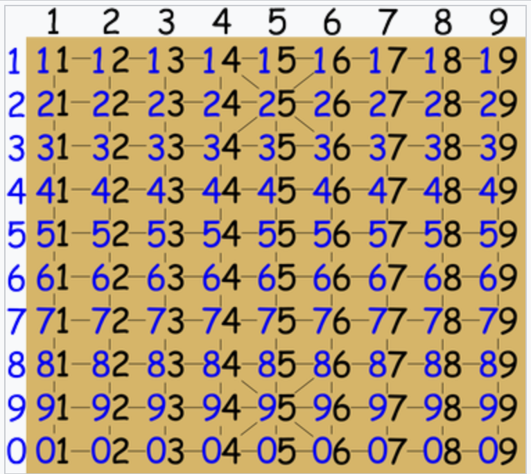

# java-janggi

장기 미션 저장소

## 기능 목록 정리
### 장기 게임

- [x] 홍과 청이 번갈아가면서 게임을 진행한다.
  - 청이 먼저 시작한다.
- [x] 상대방의 궁을 잡으면 승리한다. (게임이 끝난다)

### 장기판 상차림
- [x] 10(가로) * 9(세로)
- [x] 게임이 시작하기 전에 마와 상의 자리를 플레이어 마음대로 바꿀 수 있다.
  - [x] 총 4가지로 상차림 종류가 나뉜다. 
    - 마상상마, 마상마상, 상마마상, 상마상마
### 장기판
- [x] 기물들의 위치를 관리한다.
  - 기물, 시작위치, 목적위치를 통해 기물 위치를 변경한다.
  - 장기판을 벗어나는 위치로 이동할 수 없다.

### 장기말

- [x] 장기말은 색깔을 가지고 있다 (빨간색, 파란색)

졸, 병

- [x] 앞이나 옆으로 한 칸 이동 가능
- [x] 후퇴 불가

차

- [x] 가로, 세로 무한으로 이동 가능
- [x] 다른 기물이 이동 경로 사이에 있으면 이동 불가

상

- [x] 선 한 칸 이동 + 대각성 두 칸 이동
- [x] 다른 기물이 이동 경로 사이에 있으면 이동 불가

포

- [x] 다른 기물 하나를 넘어야만 이동 가능
- [x] 같은 포 끼리는 넘을 수 없음, 먹을 수 없음

마

- [x] 선 한 칸 이동 + 대각선 한 칸 이동
- [x] 다른 기물이 이동 경로 사이에 있으면 이동 불가

사 & 궁
- 현재: 이동 불가능
- [ ] 사&궁은 궁성 안에서만 활동이 가능하며, 궁성 밖으로 나갈 수 없다.
  - 궁성 안의 대각선 경로로도 이동이 가능
  - 한 칸씩 이동 가능리

---
#### 추후 가능한 장기의 규칙들
- 한수쉼
  - 대국자가 아무것도 움직일 수가 없거나, 마땅히 둘만한 수가 없으면, 한수 쉴 수 있는 권리가 있다.
- 종료 조건
  - 외통수
    - 장군을 했는데 상대방이 멍군을 할 수 없게 되는 경우 이를 “외통장군” 또는 “외통수”라 한다.
  - 박장
    - 궁과 궁 사이에 장애물 없이 일직선에 놓여 있으면 이를 빅장이라 하며, 행해질 시 그 게임은 무승부가 된다.
    - 박장 시 점수 계산: 차는 13,포는 7,마는 5, 상 과 사는 3, 졸병은 2이고 마지막으로 한은 후수이므로 1.5점 추가
---

## 플레이 방법
### 1.1 장기판 초기화

#### 상차림 
- 플레이어는 1 마상상마, 2 상마상마, 3 상마마상, 4 마상마상 중 옵션을 선택할 수 있다.
  - 옵션은 번호로 선택한다.

```
  | 1  2 3  4 5  6 7  8 9
--|----------------------
1 | 차 상 마 사 ㅁ 사 상 마 차
2 | ㅁ ㅁ ㅁ ㅁ 한 ㅁ ㅁ ㅁ ㅁ
3 | ㅁ 포 ㅁ ㅁ ㅁ ㅁ ㅁ 포 ㅁ
4 | 병 ㅁ 병 ㅁ 병 ㅁ 병 ㅁ 병
5 | ㅁ ㅁ ㅁ ㅁ ㅁ ㅁ ㅁ ㅁ ㅁ
6 | ㅁ ㅁ ㅁ ㅁ ㅁ ㅁ ㅁ ㅁ ㅁ
7 | 졸 ㅁ 졸 ㅁ 졸 ㅁ 졸 ㅁ 졸
8 | ㅁ 포 ㅁ ㅁ ㅁ ㅁ ㅁ 포 ㅁ
9 | ㅁ ㅁ ㅁ ㅁ 초 ㅁ ㅁ ㅁ ㅁ
0 | 차 상 마 사 ㅁ 사 상 마 차
```

### 1.2 기물 이동

### 이동 입력

(움직이기 전 위치) (기물이름) (움직일 위치)
- ex) 03 마 84

- 위치 표기는 장기 좌표 표기법에 따른다.

